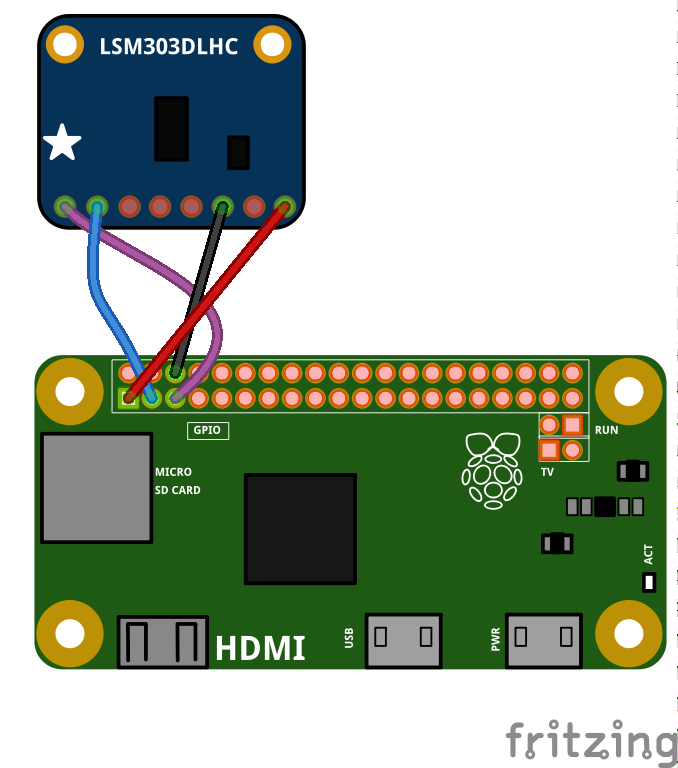

#BOM

##Hardware

1) Raspberry Pi Zero

2) Pimoroni Scroll Phat

3) Adafruit LSM303 accelerometer

4) Power bank/battery pack

(prototype)

5) Breadboard and wires

## Software

1) Adafruit LSM303 Python library, modified for Python3 (version in thsi GitHub repo)

2) [Pimoroni Scroll Phat Python library](https://github.com/pimoroni/scroll-phat)

3) Latest version of Raspbian (Jessie) 